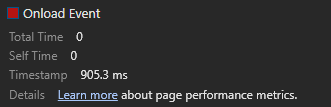
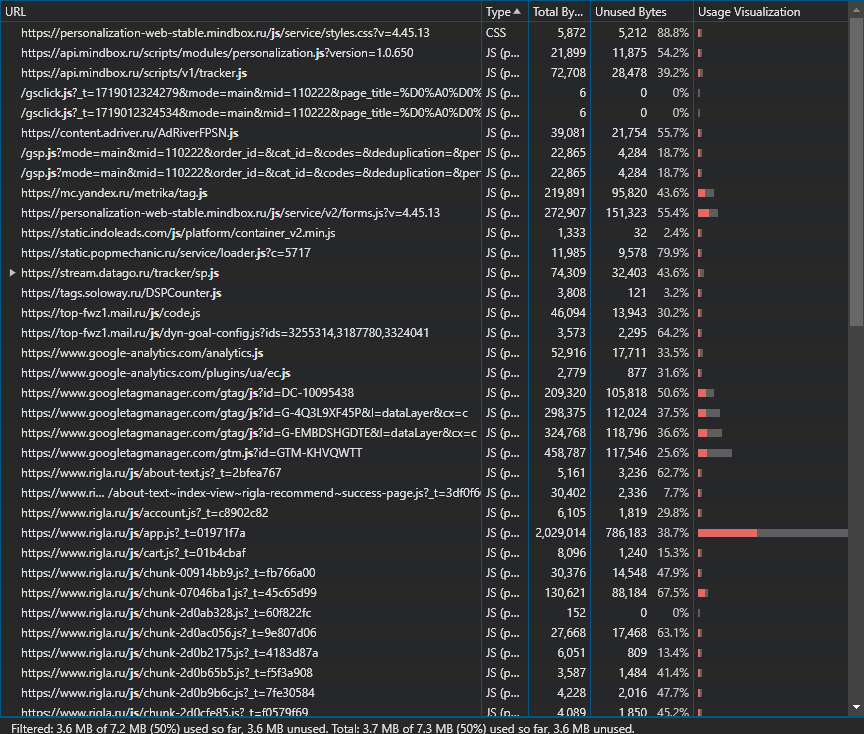

# Использование Chrome DevTools

## Вкладка Network

1. Записать и сохранить в [HAR архив](./www.rigla.ru.har) профиль загрузки ресурсов при открытии страницы
2. Неоптимальные места

Делается бесполезный пустой запрос, который вернет пустой ответ.

Очень много graphql запросов. Некоторые из них можно отложить, либо например сделать на сервере.

Есть ресурсы, которые загружаются не по http2.

Картинки можно сжать, либо перенести в современный формат для веб-изображений (webp).

  

Очень большой файл со скриптом. Его можно разделить на несколько, чтобы ускорить изначальную загрузку.

Много сторонних скриптов.

Ресурсы блокируют загрузку страницы.

## Вкладка Performance

1. Записать и сохранить в файл [профиль загрузки страницы](./Trace-20240622T012309.json)
2. измерить время в миллисекундах от начала навигации до событий First Paint (FP), First Contentful Paint (FCP), Largest Contentful Paint (LCP), DOM Content Loaded (DCL), Load.

- First Paint - 735ms
  

- First Contentful Paint - 735ms
  

- Largest Contentful Paint - 2959ms
  

- DOM Content Loaded - 696ms
  

- Load - 905ms, 1448ms
  
  

DOM-элемент, на котором происходит LCP:

Этот элемент в DOM:

Время на разные этапы рендера:

- Loading - 19ms
- Scripting - 2008ms
- Rendering - 497ms
- Painting - 494ms

## Вкладка Coverage

Вкладка Coverage после загрузки страницы.

Неиспользованный CSS в ходе загрузки страницы. 44.7 Кб

Неиспользованный JS в ходе загрузки страницы. 3591.4 Кб

